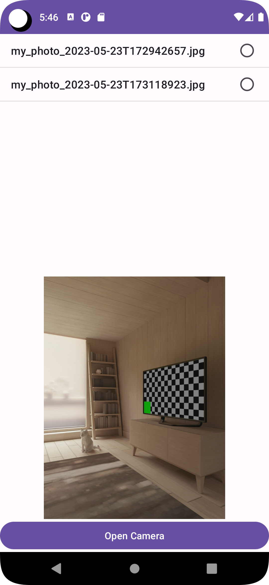

# CameraXApp

## Intro

The app uses the CameraX-Api from Android Jetpack.

It features a main view to list and preview photos that have been taken with the app.

The *Open Camera* button starts a second activity that captures and saves such photos.

## Resources

* [https://medium.com/swlh/introduction-to-androids-camerax-with-java-ca384c522c5](https://medium.com/swlh/introduction-to-androids-camerax-with-java-ca384c522c5)
* and largely on ChatGPT for saving the pictures
